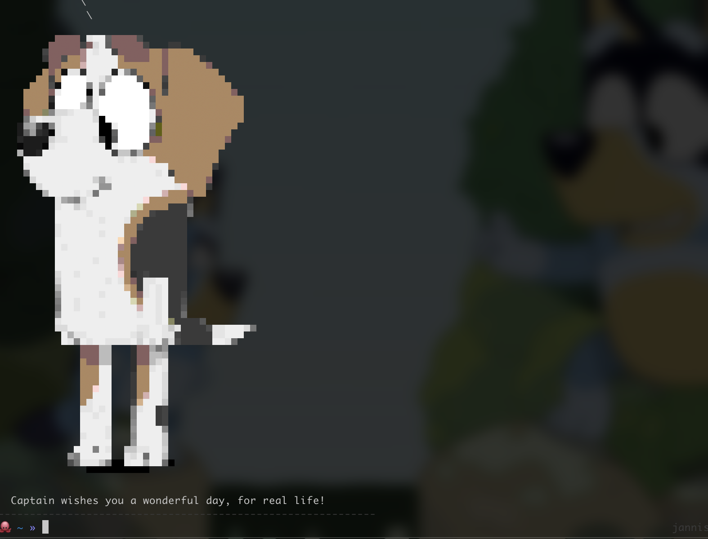

# bluey-motd
Bluey MODT? 🐕 Bluey MODT!!!!!!! 💙 WHOSEAGOODDOG? YESYOUARE! 🦴

Imagine opening your shell and being greeted by a DIFFERENT blueyTM character everytime you open your shell!  
They tell you all the information you need to know and wish you a pleasant day 😍💕  

Great for personal use, your work laptop and distributing among your friends and family! 




## Note 🧐
- This is meant to run on a mac, customize as you see fit 🥺
- Be aware that it's totally cute (and will significantly increase the time to start your shell) 😅

## Installation 

1.) Download my bluey sprites from [here](https://github.com/fruitydog/blueysay)  
2.) Change the ```dir``` variable to point to the repository  
3.) Add the code to your .zshrc (it works fantastic in conjunction with my [zsh theme](https://github.com/fruitydog/zsh-theme))  
4.) Give me headpats and call me a good dog 🐾🐶🦴 ...please 😭 ...for real life 🥺  
